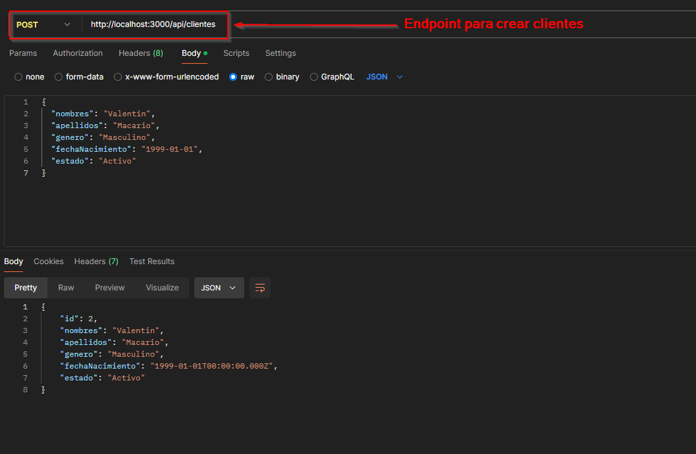
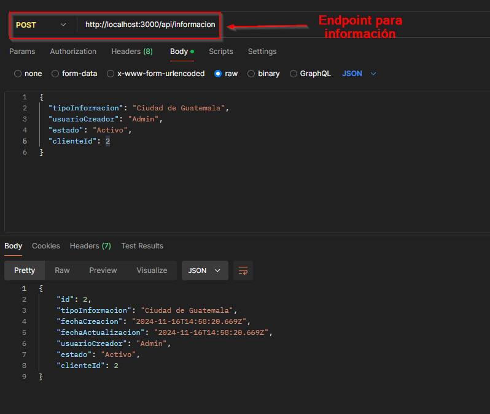
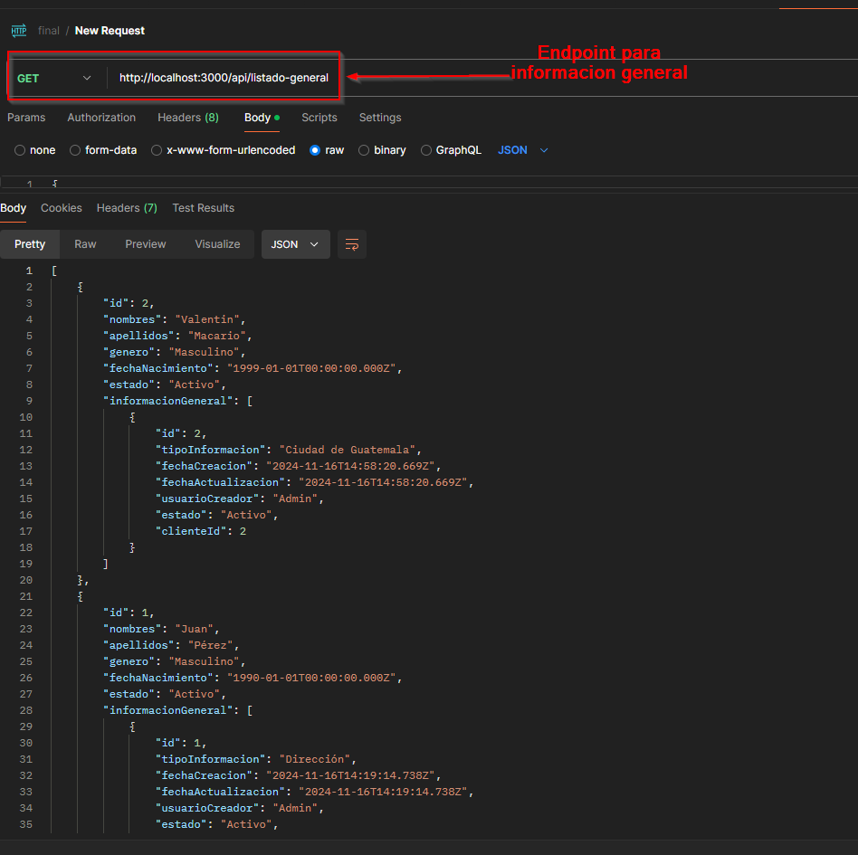
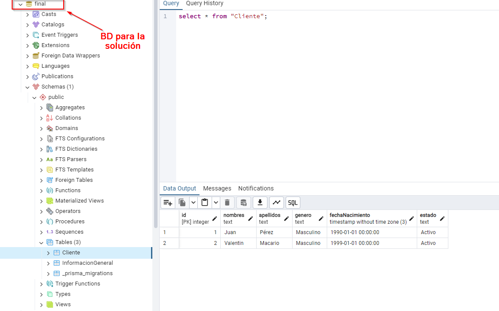

# ParcialFinal-Web

Este proyecto es una API desarrollada con **Next.js 14** para gestionar clientes y su información general, utilizando **PostgreSQL** como base de datos. La API proporciona endpoints para crear clientes, registrar información adicional, y listar datos de manera ordenada.

# Tecnologías utilizadas

- Next.js 14: Framework para construir aplicaciones web modernas.
- Prisma: ORM para la gestión de bases de datos.
- PostgreSQL: Base de datos relacional para el - almacenamiento de datos.

# Solución

- Este proyecto  se realizo localmente por lo que para consumir la api se puede utilizar el siguiente end point general: http://localhost:3000/

- Se Creó una API para clientes, en la cual se puede crear clientes por medio de peticiones POST : http://localhost:3000/api/clientes

- Una API para información  de clientes la cual se puede ingresar información por medio de peticiones POST  http://localhost:3000/api/informacion

- Una API para Consultar información  de clientes por medio de un listado la cual se puede ingresar información por medio de peticiones GET  http://localhost:3000/api/listado-general

Es importante resltar que para la solución en el almacenamiento de información se utilizo la base de datos Postgresql en la cual se crea la solución  y se conecto por medio de prisma, Creando de esta manera dos tablas para la solución del proyecto como se puede mostrar en la siguiente imagen 

- Tabla clientes : para guardar información de clientes
- Tabla informacionGeneral: para guardar información sobre la creación de clientes

